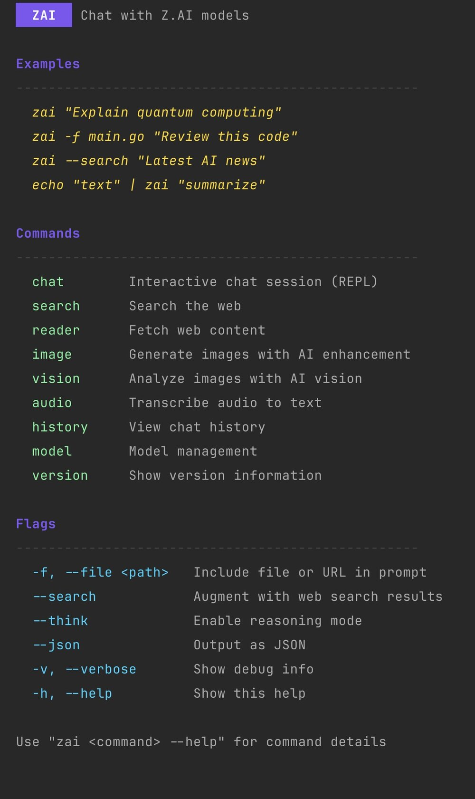

# ZAI

A fast, feature-rich CLI for [Z.AI](https://z.ai) GLM models.



## Features

- **Chat** - Interactive REPL with conversation context
- **Web Search** - Search the web and get AI-summarized results
- **Web Reader** - Fetch and analyze web content
- **Image Generation** - AI-enhanced prompts with auto-download
- **Vision** - Analyze images and extract text
- **Audio** - Transcribe audio files and YouTube videos
- **Pipes** - Full stdin/stdout support for scripting

## Installation

```bash
go install github.com/dotcommander/zai@latest
```

Or build from source:

```bash
git clone https://github.com/dotcommander/zai.git
cd zai
go build -o bin/zai .
```

## Configuration

Set your API key:

```bash
export ZAI_API_KEY="your_api_key"
```

Or create `~/.config/zai/config.yaml`:

```yaml
api:
  key: "your-api-key"
  model: "glm-4.7"        # default model
```

## Usage

### Chat

```bash
# One-shot
zai "What is the meaning of life?"

# With file context
zai -f main.go "Review this code"

# Interactive REPL
zai chat

# With reasoning mode
zai --think "Solve this step by step"

# Web search augmented
zai --search "Latest news on AI"
```

### Pipes

```bash
cat error.log | zai "What's wrong?"
git diff | zai "Write a commit message"
pbpaste | zai "Summarize this"
```

### Web

```bash
# Search
zai search "golang best practices"
zai search "AI news" -c 5 -r oneWeek

# Read web pages
zai reader https://example.com
zai "Summarize https://example.com/article"  # auto-detected
```

### Image Generation

```bash
zai image "a wizard in a library"
zai image "sunset" --size 1024x1024
zai image "logo" -o logo.png --no-enhance
```

Images are automatically enhanced with professional photography prompts and saved locally.

### Vision

```bash
zai vision photo.jpg
zai vision screenshot.png "What text is here?"
zai vision chart.png "Explain the trends"
```

### Audio

```bash
zai audio recording.wav
zai audio podcast.mp3 --vad              # Remove silence
zai audio --video https://youtu.be/xxx   # YouTube
zai audio lecture.wav --hotwords "k8s,docker"
```

Supports: .wav, .mp3, .mp4, .m4a, .flac, .aac, .ogg

**Optional dependencies**: `ffmpeg`, `yt-dlp` (for YouTube)

### JSON Output

```bash
zai "What is 2+2?" --json
zai search "query" --json
zai history --json
```

## Commands

| Command | Description |
|---------|-------------|
| `chat` | Interactive chat session |
| `search` | Web search |
| `reader` | Fetch web content |
| `image` | Generate images |
| `vision` | Analyze images |
| `audio` | Transcribe audio |
| `history` | View chat history |
| `model` | Model management |

## Flags

| Flag | Description |
|------|-------------|
| `-f, --file` | Include file or URL in prompt |
| `--search` | Augment with web search |
| `--think` | Enable reasoning mode |
| `--json` | Output as JSON |
| `-v, --verbose` | Show debug info |

## Shell Completion

```bash
# Bash
zai completion bash > ~/.local/share/bash-completion/completions/zai

# Zsh
zai completion zsh > "${fpath[1]}/_zai"

# Fish
zai completion fish > ~/.config/fish/completions/zai.fish
```

## Requirements

- Go 1.21+
- Z.AI API key

## License

MIT
